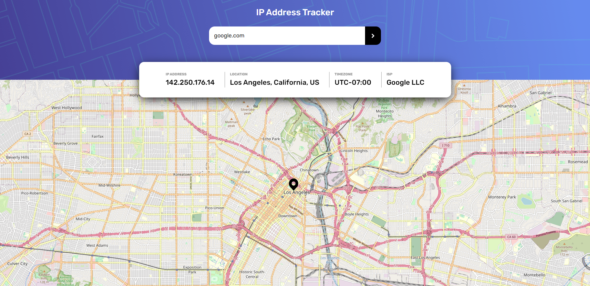

# **IP Tracker App**

Welcome to the IP Tracker App! This is a React-based web application that allows users to track the IP address and location of a given domain or IP address. Whether you're troubleshooting network issues or just curious about the location of a website, this app makes it easy to get the information you need.

The app uses Semantic HTML5, Flexbox, and CSS grid to create a clean and responsive user interface that is optimized for a mobile-first workflow. It also fetches data from two APIs, the Leaflet maps API and the ipfy API, to display a map of the location associated with the IP address and additional information about the domain or IP address.

This is a solution to the [IP address tracker challenge on Frontend Mentor](https://www.frontendmentor.io/challenges/ip-address-tracker-I8-0yYAH0). Frontend Mentor challenges help you improve your coding skills by building realistic projects.

## **Features**

- **Track IP address and location:** Enter a domain name or IP address into the search bar, and the app will display the location on a map using the Leaflet maps API.

- **Additional information:** The app provides additional information about the domain or IP address, including the ISP, country, region, and timezone using the ipfy API.

- **Mobile-first design:** The app is optimized for mobile devices, with a clean and responsive design that adapts to different screen sizes.

- **Easy to use:** With a simple and intuitive interface, the IP Tracker App is easy to use for both novice and experienced users.

## **Usage**

To use the app, simply enter a domain or IP address in the search bar and press the arrow button. The app will fetch data from the APIs and display the information on the page, including the location on the map and the detailed information about the domain or IP address.

### Live Site URL : [Demo](https://surriyaluavan.github.io/IP-address-tracker/)

## **Screenshots**

 

## **Technologies Used**

The IP Tracker App uses the following technologies:

- React Library
- Semantic HTML5
- Mobile-first workflow
- Flexbox
- CSS grid
- Leaflet maps API
- ipfy API

## Author

- Website - [Surriya Luavan Minatchy](https://www.your-site.com)
- LinkedIn - [@Surriya Luavan Minatchy](https://www.linkedin.com/in/surriya-luavan-minatchy/)
